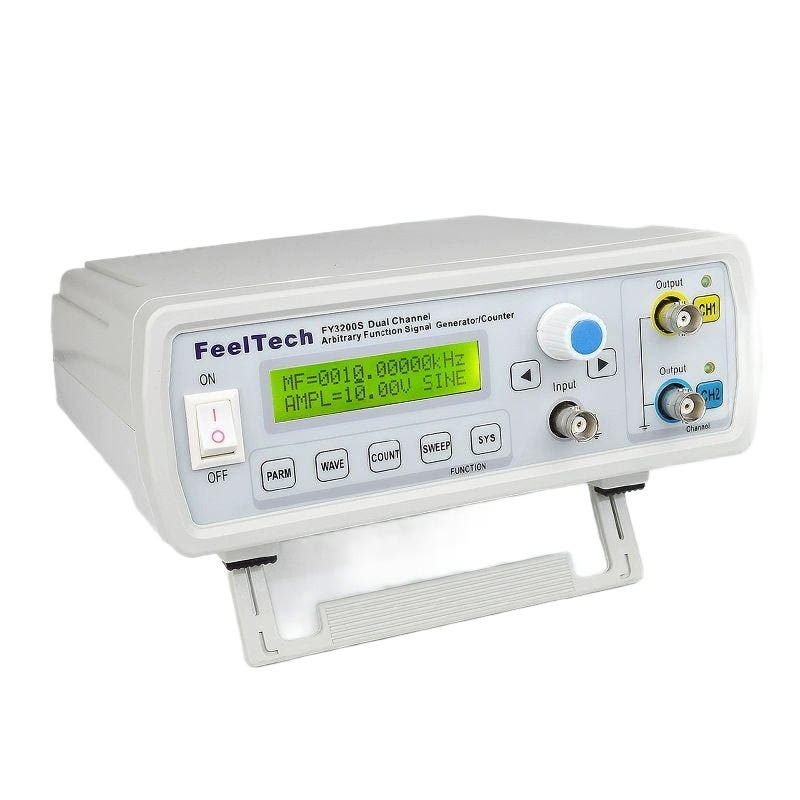
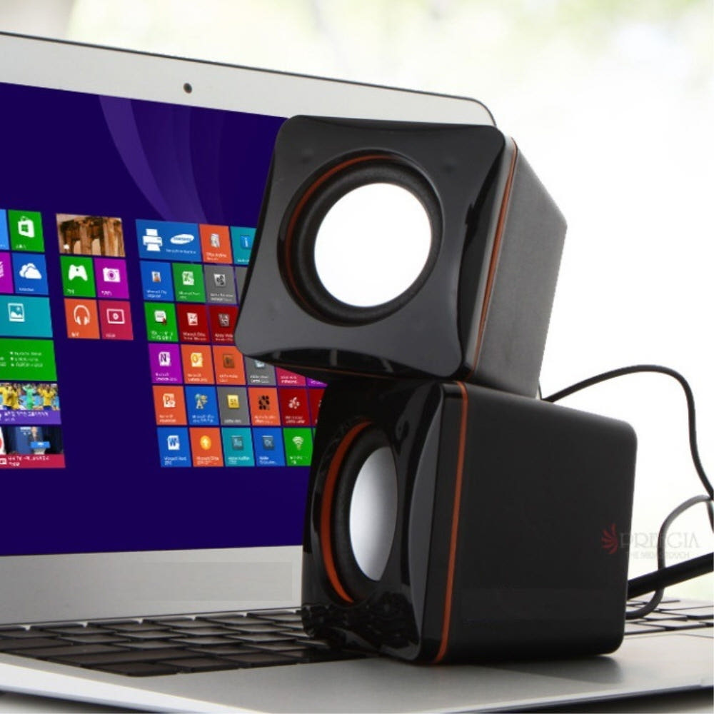
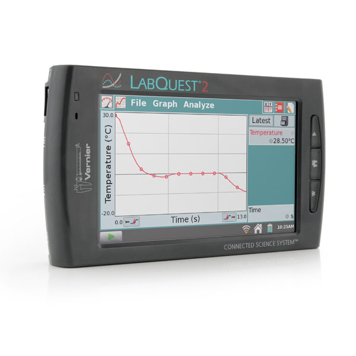
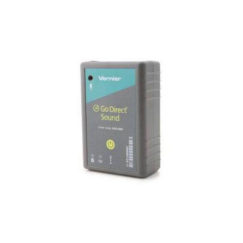
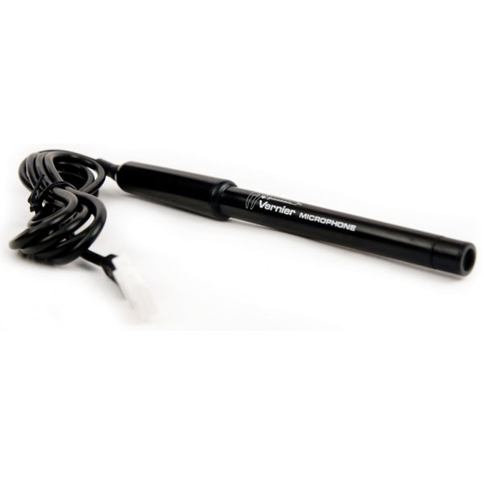
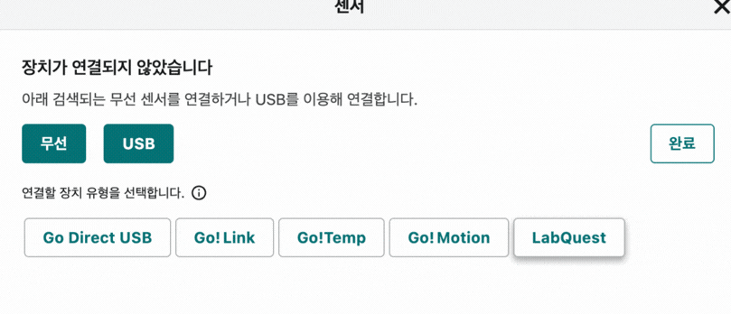

# 1. 실험 장비 및 측정 준비

기본 기기 조합: 함수발생기 + 스피커 + MBL 소리 센서

---

# 함수발생기

  

    
  

  

    <h2>원하는 주파수의 정현파·사각파 생성</h2>
    <ul class="mt-4 space-y-3">
      <li>가격대: 약 10만 원대부터 수백만 원대까지 다양</li>
      <li>200~500 Hz 정도로 설정하고 스피커와 연결</li>
      <li>소리의 높이와 진동수의 관계를 비교할 수 있음</li>
    </ul>
  

> 그림 파일: `네이버 쇼핑 - 함수발생기 검색`

---

# USB 스피커

  

    
  

  

    <ul class="space-y-4">
      <li>USB 5 V 전원과 AUX 케이블로 연결</li>
      <li>기기 연결 방식에 따라 USB-C to AUX 젠더 필요</li>
      <li>함수발생기 출력을 소리로 변환해 재생</li>
      <li>네이버 쇼핑 기준 약 8,000원부터 구매 가능</li>
    </ul>
  

---

# MBL 인터페이스

  

    
  

  

    <ul class="space-y-4">
      <li>센서와 연결해 데이터를 시각화하고 분석하는 전용 인터페이스</li>
      <li>인터페이스 화면에서 측정 파형을 바로 확인 가능</li>
      <li>모델에 따라 PC와 연결해 PC에서 시각화 및 분석 가능</li>
    </ul>
  

---

# 소리 측정 센서: 무선

  

    
  

  

    <ul class="space-y-2">
      <li>본 원 내 1대 보유 (2026년 8월 현재)</li>
      <li>유선·무선 연결 가능</li>
      <li>소리 레벨 주파수 범위: 30~10,000 Hz</li>
      <li>실험당 최대 5,000개 데이터 포인트</li>
      <li>샘플링레이트 [/s] × 관측시간 [s] = 5,000</li>
      <li>마이크로폰 레벨 (음압)</li>
      <li>기기 내부 고유값으로, hPa와 같은 물리 단위가 아닌 임의의 값</li>
      <li>음압(마이크 모드)으로 파형을 관찰</li>
    </ul>
  

> 출처: [한국과학-고 무선 소리 센서]

---

# 소리 측정 센서: 유선

  

    
  

  

    <ul class="space-y-1">
      <li>본 원 내 6대 보유 (2026년 8월 현재)</li>
      <li>유선 연결 가능, LabQuest에서 분석 권장</li>
      <li>소리 레벨 주파수 범위: 100~15,000 Hz</li>
      <li>실험당 최대 3,000개 데이터 포인트</li>
      <li>샘플링레이트 [/s] × 관측시간 [s] = 3,000</li>
      <li>마이크로폰 레벨 (음압)</li>
      <li>기기 내부 고유값으로, hPa와 같은 물리 단위가 아닌 임의의 값</li>
      <li>음압(마이크 모드)으로 파형을 관찰</li>
      <li>LabQuest에서 FFT 분석 지원</li>
    </ul>
  

> 출처: [한국과학-마이크로폰]

---

# 측정 장비 구성

  

    <h3>소리 생성</h3>
    <ul>
      <li>함수발생기</li>
      <li>스피커</li>
      <li>정현파, 220 Hz 또는 440 Hz</li>
    </ul>
  

  

    <h3>파형 수집</h3>
    <ul>
      <li>MBL 소리 센서</li>
      <li>PC 또는 LabQuest 연결</li>
      <li>음압 데이터 기록</li>
    </ul>
  

  

    <h3>데이터 확인</h3>
    <ul>
      <li>시간 영역 파형 관찰</li>
      <li>측정 조건 기록</li>
      <li>파형 데이터 저장</li>
    </ul>
  

---

# 측정 전 점검

- 스피커와 MBL 소리 센서를 약 10 cm 이상 떨어뜨려 설치한다.
- 음원 종류, 설정 주파수, 출력 크기, 마이크 위치를 확인한다.
- 샘플링레이트(fs)와 측정 시간을 확인한다.
- 440 Hz 기록에는 최소 880 Hz 이상의 샘플링레이트가 필요하며, 파형 관찰에는 그보다 충분히 높은 값을 사용한다.

> 안전: 함수발생기의 출력을 스피커 허용 범위 안에서 낮게 시작하고, 음량을 단계적으로 높인다.

---

# 교실 대체 장비

| 표준 장비 | 대체 장비 | 수업에서 확인할 값 |
| --- | --- | --- |
| 함수발생기 | 노트북/스마트폰 톤 생성 앱 | 설정 주파수 |
| MBL 소리 센서 | 스마트폰 앱/노트북 마이크 | 주기, 진동수, 상대 진폭 |
| LabQuest/PC | 노트북 | 파형, 스펙트럼 |

> 대체 장비의 세부 앱 조작은 별도 자료로 제공한다.

---

# LabQuest 2와 PC 연결

  

    <h3>처음 한 번만 설치</h3>
    <ol class="mt-4 space-y-1">
      <li><a href="https://koreasci.com/shop1/front/php/b/board_list.php?board_no=1002&amp;is_pcver=T">Graphical Analysis 프로그램 다운로드</a> 후 설치</li>
      <li>LabQuest 2에 소리센서와 PC 연결</li>
    </ol>
  

  

    <h3>웹브라우저에서 연결</h3>
    <ol class="mt-4 space-y-1">
      <li><a href="https://graphicalanalysis.app">graphicalanalysis.app</a>에 접속</li>
      <li>센서 → USB → LabQuest 선택</li>
      <li>팝업 창에서 LabQuest 2 선택</li>
      <li>LabQuest에 연결된 소리 센서 확인</li>
    </ol>
  

  

