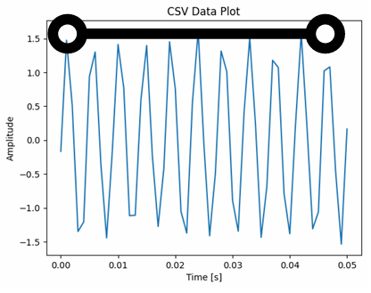

# 3. 기본 측정과 파형 관찰

<div class="text-2xl mt-8 text-blue-600 font-semibold">활동 1: 생성한 정현파를 MBL로 기록하고 파형을 읽는다.</div>

---

# 활동 1. 정현파 기록

<div class="grid grid-cols-2 gap-8 mt-8 text-left">
  <div class="p-5 border rounded-xl">
    <h3>실행</h3>
    <ol>
      <li>함수발생기를 220 Hz 또는 440 Hz 정현파로 설정한다.</li>
      <li>스피커를 연결하고 낮은 출력부터 소리를 낸다.</li>
      <li>MBL 센서로 0.05~0.10 s 구간을 기록한다.</li>
      <li>컴퓨터 화면에서 시간-음압 파형을 관찰한다.</li>
    </ol>
  </div>
  <div class="p-5 border rounded-xl">
    <h3>기록</h3>
    <ul>
      <li>설정 진동수와 샘플링레이트</li>
      <li>측정 시간과 스피커-마이크 거리</li>
      <li>파형에서 읽은 주기(T)</li>
      <li>주기로 계산한 진동수</li>
    </ul>
  </div>
</div>

---

# 클래스룸 활동지 작성

<div class="grid grid-cols-3 gap-6 mt-8 text-left">
  <div class="p-5 border rounded-xl">
    <h3>활동 1: 주파수 측정과 오차 분석 (Q1)</h3>
    <ul class="mt-3 space-y-2 text-base">
      <li>낮은 음과 높은 음의 입력 주파수(A)를 기록</li>
      <li>파형에서 계산한 측정 주파수(B)를 기록</li>
      <li>오차 |A-B| / A &times; 100을 계산</li>
      <li>입력값과 측정값의 오차 원인을 서술</li>
    </ul>
  </div>
  <div class="p-5 border rounded-xl">
    <h3>활동 2: 소리 크기와 진폭 비교 (Q2)</h3>
    <ul class="mt-3 space-y-2 text-base">
      <li>작은 소리와 큰 소리의 파형을 각각 캡처</li>
      <li>최대 진폭(y축 값)의 차이를 기록</li>
      <li>소리가 커질 때 변하는 그래프 값을 서술</li>
    </ul>
  </div>
  <div class="p-5 border rounded-xl">
    <h3>활동 3: 음색 생성기와 실제 목소리 비교 (Q3)</h3>
    <ul class="mt-3 space-y-2 text-base">
      <li>음색 생성기 정현파와 사각파를 각각 캡처</li>
      <li>두 파형의 모양을 비교</li>
      <li>파형 모양이 다른 이유를 서술</li>
    </ul>
  </div>
</div>

> 기록, 파형 캡처, 분석 답변은 클래스룸에 올라간 활동지에 작성한다.

---

# 파형에서 주기 측정하기

<div class="grid grid-cols-2 gap-8 mt-6 items-center">
  <div class="border rounded-xl p-4">
    
  </div>
  <div class="text-left text-lg">
    <h2>이 실험 데이터에서 음파의 주기를 구하려면?</h2>
    <ol class="mt-5 space-y-3">
      <li>연속된 최고점 사이의 시간 간격을 확인한다.</li>
      <li>0.001 s부터 0.047 s까지 10개 주기의 간격은 0.046 s이다.</li>
      <li>주기: 0.046 s / 10 = 0.0046 s</li>
      <li>진동수: 1 / 0.0046 s &asymp; 217 Hz</li>
    </ol>
  </div>
</div>

---

# CSV 저장과 공통 데이터 형식

- 측정 데이터는 CSV로 저장해 심화 분석(피팅 등)에 사용할 수 있다.
- 공통 예제 형식: `time_s`(초), `signal`(음압 또는 전압)

```text
time_s,signal
0.000000,0.012
0.000100,0.034
0.000200,0.056
0.000300,0.088
...
```
