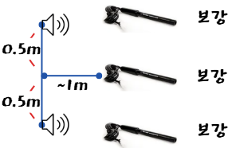

# 4. 소리의 간섭과 맥놀이 체험

활동 2·3: 공간 간섭과 시간 맥놀이를 구분해 관찰한다.

---

# 활동 2. 같은 주파수의 소리 간섭

  

    <h3>준비와 실행</h3>
    <ol>
      <li>두 스피커에서 같은 주파수의 정현파를 재생한다.</li>
      <li>MBL 소리 센서를 두 스피커 앞에서 일정한 경로로 이동한다.</li>
      <li>각 위치에서 파형의 상대 진폭을 기록한다.</li>
    </ol>
  

  

    <h3>관찰과 해석</h3>
    <ul>
      <li>큰 진폭: 보강 간섭 위치</li>
      <li>작은 진폭: 상쇄 간섭 위치</li>
      <li>위치에 따른 음압 변화 기록</li>
      <li>같은 주파수에서는 위상차가 일정함</li>
    </ul>
  

> 주의: 같은 주파수의 간섭은 한 위치에서 음량이 주기적으로 변하는 맥놀이가 아니라, 공간에 따른 세기 분포를 보는 활동이다.

---

# 활동 2. 실험 세팅

  

    
  

  

    <ul class="space-y-4">
      <li>두 스피커를 (0 m, -0.5 m), (0 m, 0.5 m)에 설치한다.</li>
      <li>하나의 함수발생기 출력을 분기해 두 스피커에 같은 440 Hz 정현파를 공급한다.</li>
      <li>소리 센서는 (1 m, 0)에서 시작해 y축 방향으로 이동한다.</li>
      <li>y = 0에서는 보강, 약 y = &plusmn;0.63 m에서는 상쇄 간섭이 예상된다.</li>
      <li>센서를 y = -1.5 m부터 +1.5 m까지 이동하며 진폭을 기록한다.</li>
    </ul>
  

---

# 활동 3. 맥놀이 체험

  

    <h3>준비와 실행</h3>
    <ol>
      <li>두 음원을 220 Hz와 222 Hz로 각각 설정한다.</li>
      <li>두 스피커로 동시에 재생한다.</li>
      <li>MBL 센서를 한 위치에 고정해 수 초간 기록한다.</li>
      <li>소리 크기가 반복해서 커졌다 작아지는 주기(포락선)를 관찰한다.</li>
    </ol>
  

  

    <h3>예상 결과</h3>
    
고주파 진동 위로 느린 진폭 변화가 나타난다.

    
두 음원의 주파수 차가 맥놀이 진동수가 된다.

  

$$
f_{\text{beat}} = |220 - 222| = 2\,\mathrm{Hz}
$$

즉, 1초에 약 2번 소리가 커졌다 작아진다.

---

# 간섭과 맥놀이 비교

| 구분 | 같은 주파수 간섭 | 맥놀이 |
| --- | --- | --- |
| 음원 | 같은 주파수 | 조금 다른 주파수 |
| 주된 변화 | 공간에 따른 세기 변화 | 시간에 따른 진폭 변화 |
| 센서 사용 | 마이크 위치를 이동 | 한 위치에 고정 |
| 관찰값 | 보강·상쇄 위치 | 포락선 주기, 맥놀이 진동수 |
