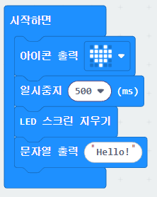
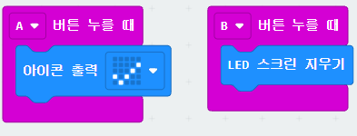
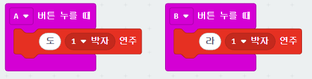

# 1. 마이크로비트 기초 및 실습 환경 구축

### 🎯 1부 학습 목표
- MakeCode 블록 코딩 환경과 마이크로비트 v2 연결
- **1단계:** 기본 출력 (LED 그리드 켜기)
- **2단계:** 입력 이벤트 (A/B 버튼으로 화면 제어)
- **3단계:** 소리 출력 (버튼으로 특정 진동수의 음 출력)

---

# [1단계] MakeCode 접속 및 기기 연결 (WebUSB)

### 마이크로비트와 PC 직접 연결하기

1. 웹 브라우저(Chrome/Edge)에서 **makecode.microbit.org** 접속 후 **[새 프로젝트]** 클릭
2. 마이크로비트 v2를 USB 케이블로 PC와 연결
3. 좌측 하단 **[저장]** 버튼 옆 `...` 클릭 $\rightarrow$ **[기기 연결(Pair device)]** 선택
4. 팝업 창에서 `BBC micro:bit` 선택 후 **[연결]** 클릭

> **장점:** 한 번 연결해 두면 [다운로드] 버튼을 누를 때마다 마이크로비트로 즉시 코드가 전송됩니다.

<!--
[발표자 노트]
기기 연결(WebUSB)이 원활하지 않을 경우, 다운로드된 .hex 파일을 마이크로비트 드라이브로 직접 드래그 앤 드롭하는 전통적인 방식도 함께 안내해 주세요.
-->

---
layout: two-cols
gap: 6
---

# [2단계] 기본 출력: LED에 내 모습 표현하기

::left::

### 화면에 아이콘 및 문자 출력하기

- **[기본]** 카테고리 블록을 사용하여 아이콘을 출력하고 지우는 순차 구조를 확인합니다.

- **핵심 동작:**
  1. 아이콘 출력 (하트 모양)
  2. 0.5초(500ms) 대기
  3. 화면 지우기
  4. 문자열("Hello!") 출력

::right::

<!--
[발표자 노트 - MakeCode JavaScript]
basic.showIcon(IconNames.Heart)
basic.pause(500)
basic.clearScreen()
basic.showString("Hello!")
-->

---

# [3단계] 입력 이벤트: A/B 버튼 스위치 만들기

### Physical Computing의 시작: 입력에 따른 반응

- 마이크로비트 전면의 **A 버튼**과 **B 버튼**은 디지털 입력 장치 역할을 합니다.
- **[입력]** 카테고리의 `~누르면 실행` 블록을 활용하여 조건별 반응을 구성합니다.

- **A 버튼 누름:** LED에 체크 표시 출력
- **B 버튼 누름:** LED 화면 모두 끄기

<!--
[발표자 노트 - MakeCode JavaScript]
input.onButtonPressed(Button.A, function () {
    basic.showIcon(IconNames.Yes)
})
input.onButtonPressed(Button.B, function () {
    basic.clearScreen()
})
-->

---

# [4단계] 소리 출력: 버튼으로 소리 내기

### 내장 스피커 활용 기본 톤 출력

- 마이크로비트 v2 뒷면에는 스피커가 내장되어 있어 별도 부품 없이 소리를 출력할 수 있습니다.
- **[음악]** 카테고리의 `톤 출력` 블록을 사용하여 특정 진동수(Hz)의 소리를 내봅니다.

- **A 버튼:** 262Hz (중앙 C / '도') 소리 내기
- **B 버튼:** 440Hz (A4 / '라') 소리 내기

<!--
[발표자 노트 - MakeCode JavaScript]
input.onButtonPressed(Button.A, function () {
    music.playTone(262, music.beat(BeatFraction.Whole))
})
input.onButtonPressed(Button.B, function () {
    music.playTone(440, music.beat(BeatFraction.Whole))
})
-->

---

# 1부 실습 점검 및 2부 연결

### 1부 점검 체크리스트
- [ ] WebUSB 연결로 다운로드 버튼 클릭 시 즉시 코드가 들어가는가?
- [ ] A 버튼과 B 버튼 입력에 따라 LED 화면이 바뀌는가?
- [ ] 버튼을 눌렀을 때 262Hz, 440Hz의 소리가 각각 제대로 나는가?

---

### 💡 2부 실습으로의 연결 포인트
- 1부에서는 **버튼**을 눌러 '도'와 '라'라는 **고정된 진동수**만 출력했습니다.
- 2부에서는 **가변저항**을 회로에 연결하여, 전압의 물리적 변화량에 따라 **소리의 진동수를 연속적으로 제어하는 전자악기**를 만들어 봅니다.